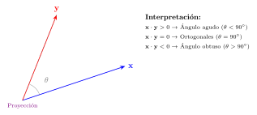
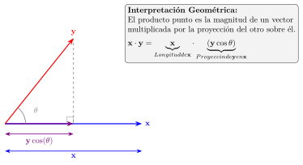

# Poniendo el Motor en Marcha: Aritmética Tensorial

## Suma de vectores y Aplicaciones

La suma combina dos vectores componente a componente. En términos de datos, esta operación representa la acumulación o superposición de efectos provenientes de distintas fuentes.

**Definición formal.** Sean $\mathbf{x}, \mathbf{y} \in \mathbb{R}^n$. La suma $\mathbf{x} + \mathbf{y}$ se define como:

$$\mathbf{x} + \mathbf{y} = 
\begin{pmatrix} x_1 \\ x_2 \\ \vdots \\ x_n \end{pmatrix} + 
\begin{pmatrix} y_1 \\ y_2 \\ \vdots \\ y_n \end{pmatrix} = 
\begin{pmatrix} x_1 + y_1 \\ x_2 + y_2 \\ \vdots \\ x_n + y_n \end{pmatrix}.$$


<figure markdown="span">
  
  <figcaption>Representación geométrica de la suma vectorial (Ley del Paralelogramo). El vector resultante conecta el origen con la esquina opuesta formada por la proyección de los vectores $\mathbf{x}$ y $\mathbf{y}$.</figcaption>
</figure>


Geométricamente, esto sigue la **ley del paralelogramo** [1.1](#suma_vectores){reference-type="ref" reference="suma_vectores"}: si colocamos el inicio de $\mathbf{y}$ en la punta final de $\mathbf{x}$, el vector resultante va desde el origen de $\mathbf{x}$ hasta la punta final de $\mathbf{y}$.

> Ejemplo Ambiental: Inventario de Emisiones Supongamos que en una zona industrial existen dos fuentes principales de contaminación: una Termoeléctrica ($\mathbf{e}_T$) y una Fábrica de Cemento ($\mathbf{e}_C$). Los vectores representan la emisión diaria (en toneladas) de tres contaminantes distintos: $[\text{CO}_2, \text{NO}_x, \text{Material Particulado}]$.
>
> $$\mathbf{e}_T = \begin{pmatrix} 100 \\ 5 \\ 0.5 \end{pmatrix}, \quad
> \mathbf{e}_C = \begin{pmatrix} 40 \\ 2 \\ 3.5 \end{pmatrix}$$
>
> Para conocer la **carga total** que recibe la atmósfera en esa zona, realizamos la suma vectorial:
>
> $$\mathbf{e}_{total} = \mathbf{e}_T + \mathbf{e}_C = 
> \begin{pmatrix} 100 + 40 \\ 5 + 2 \\ 0.5 + 3.5 \end{pmatrix} = 
> \begin{pmatrix} 140 \\ 7 \\ 4.0 \end{pmatrix}$$
>
> **Interpretación:** La suma vectorial garantiza la integridad de las variables: sumamos dióxido de carbono solo con dióxido de carbono ($140$ ton), y partículas solo con partículas ($4.0$ ton). Mezclar componentes (sumar el CO$_2$ de una fábrica con el polvo de otra) carecería de sentido físico.

##### Aplicaciones sectoriales: Agro y Mecatrónica

-   **Fusión de sensores (Agro):** Un nodo IoT registra variables climáticas de dos sensores para redundancia. Si el sensor A entrega el vector de estado $\mathbf{s}_A$ y el sensor B entrega $\mathbf{s}_B$, la suma (o promedio vectorial) permite reducir el ruido aleatorio y obtener una lectura más robusta del ambiente.

-   **Acumulación temporal (Ambiental):** El vector de emisiones diarias de un biodigestor se suma a lo largo de una semana ($t=1 \dots 7$) para obtener el impacto total acumulado:

    $$\mathbf{e}_{\text{semanal}} = \mathbf{e}_{\text{lun}} + \mathbf{e}_{\text{mar}} + \dots + \mathbf{e}_{\text{dom}}$$

    Esto permite reportar totales de $\mathrm{CH}_4$ y $\mathrm{CO}_2$ sin perder la distinción entre gases.

-   **Composición de insumos (Agroindustrial):** En la formulación de alimento balanceado, el vector nutricional final (proteína, energía, fibra) se construye sumando los aportes vectoriales de cada ingrediente (maíz, soya, núcleo vitamínico), lo que permite verificar si la mezcla final cumple con los requerimientos dietarios.

-   **Corrección de Trayectoria (Mecatrónica/Robótica):** Un dron de fumigación agrícola debe volar en una ruta ideal representada por el vector de velocidad $\mathbf{v}_{ideal}$. Sin embargo, enfrenta un viento lateral representado por el vector $\mathbf{v}_{viento}$. Para mantener el curso, el sistema de control o la IA debe calcular la velocidad real resultante mediante la suma vectorial:

    $$\mathbf{v}_{real} = \mathbf{v}_{ideal} + \mathbf{v}_{viento}$$

    Si el resultado desvía al dron del cultivo, la IA debe generar un vector de compensación opuesto para anular la perturbación.

En todos estos casos, la suma vectorial permite construir representaciones compuestas que capturan la complejidad de los sistemas físicos, preparándolas para su análisis mediante algoritmos de control o modelos de inteligencia artificial.

## Multiplicación por un escalar

Esta operación modifica la magnitud del vector sin alterar su línea de acción. Matemáticamente, escala todas las componentes por un mismo factor $\alpha$.

**Definición formal.** Dado un escalar $\alpha \in \mathbb{R}$ y un vector $\mathbf{x} \in \mathbb{R}^n$, el producto $\alpha \mathbf{x}$ se define como:

$$\alpha \mathbf{x} = 
\alpha \begin{pmatrix} x_1 \\ \vdots \\ x_n \end{pmatrix} = 
\begin{pmatrix} \alpha x_1 \\ \vdots \\ \alpha x_n \end{pmatrix}.$$

**Interpretación Geométrica:** El efecto del escalar $\alpha$ sobre el vector original $\mathbf{x}$ depende de su valor:

-   Si $|\alpha| > 1$, el vector se **alarga** (dilatación).

-   Si $|\alpha| < 1$, el vector se **contrae** (compresión).

-   Si $\alpha < 0$, el vector **invierte su sentido** ($180^\circ$), aunque mantiene la misma línea de dirección.


<figure markdown="span">
  
  <figcaption>Efecto geométrico de la multiplicación escalar. Nótese cómo α=2 duplica la longitud, mientras que α=-0.5 reduce la longitud a la mitad e invierte el sentido.</figcaption>
</figure>


#### Aplicaciones: Escalamiento y Control

1.  **Agro (Proyección de Insumos):** Suponga que el vector $\mathbf{d}$ representa la dosis de fertilizantes para **1 hectárea**: $\mathbf{d} = [100, 50, 30]^\top$ (kg de N, P, K). Si un agricultor desea fertilizar un lote de 15 hectáreas, el requerimiento total es simplemente el vector escalado por la superficie:

    $$\mathbf{Total} = 15 \cdot \mathbf{d} = \begin{pmatrix} 1500 \\ 750 \\ 450 \end{pmatrix} \text{ kg}.$$

2.  **Mecatrónica (Ganancia de Control):** En un sistema de control de un robot, el "error" de posición es un vector $\mathbf{e}$ (diferencia entre dónde está y dónde debería estar). El controlador aplica una corrección proporcional multiplicando ese error por una ganancia $K_p$ (un escalar).

    $$\mathbf{u} = K_p \cdot \mathbf{e}$$

    Si $K_p$ es muy grande, el robot reacciona violentamente (gran vector de fuerza); si es pequeño, reacciona suavemente.

## Producto punto (producto escalar)

El **producto punto** es la operación fundamental para conectar la geometría (ángulos, longitudes) con el álgebra. Mide el grado de alineación entre dos vectores: si apuntan en la misma dirección, el valor es grande y positivo; si son perpendiculares, es cero; si apuntan en sentidos opuestos, es negativo.

**Definición formal.**

$$\cdot : \mathbb{R}^n \times \mathbb{R}^n \to \mathbb{R}, \quad (\mathbf{x}, \mathbf{y}) \mapsto \mathbf{x} \cdot \mathbf{y} = \sum_{i=1}^{n} x_i y_i.$$

#### Interpretación Geométrica y Similitud

Además de la operación algebraica componente a componente, el producto punto satisface una identidad geométrica fundamental, ilustrada en la Figura [1.3](#fig:producto_punto){reference-type="ref" reference="fig:producto_punto"}:

$$\mathbf{x} \cdot \mathbf{y} = \lVert \mathbf{x} \rVert \lVert \mathbf{y} \rVert \cos(\theta),$$

donde $\theta$ es el ángulo entre los vectores. Esta relación permite aislar el término del coseno para definir la **Similitud Coseno**, una métrica esencial en Inteligencia Artificial para medir qué tan similares son dos vectores independientemente de su magnitud:


<figure markdown="span">
  
  <figcaption>Relación entre magnitudes y ángulo. El producto punto conecta la longitud de los vectores con el coseno del ángulo θ que forman entre sí.</figcaption>
</figure>


$$\cos(\theta) = \frac{\mathbf{x} \cdot \mathbf{y}}{\lVert \mathbf{x} \rVert \lVert \mathbf{y} \rVert}.$$

Como se observa en la Figura [1.4](#fig:producto_punto_geo){reference-type="ref" reference="fig:producto_punto_geo"}, geométricamente esto equivale a evaluar la proyección o \"sombra\" de un vector sobre el otro. Si el ángulo es cero (vectores alineados), la similitud es máxima (1); si son ortogonales (90°), es nula (0).


<figure markdown="span">
  
  <figcaption>Interpretación de la proyección. La línea violeta muestra la componente de y que está "alineada" con x. El producto punto es el resultado de multiplicar esta proyección por la longitud total de x.</figcaption>
</figure>


##### Aplicaciones en Ingeniería y Agro

1.  **Agro (Firmas Espectrales):** En teledetección, una planta sana tiene una "firma" o vector ideal $\mathbf{v}_{sana}$ (valores de reflectancia en distintas bandas). Si el dron mide un vector actual $\mathbf{v}_{medido}$, calculamos el producto punto (normalizado) entre ambos.

    -   Si $\cos(\theta) \approx 1$, la firma es casi idéntica $\to$ Planta Sana.

    -   Si $\cos(\theta) \ll 1$, la alineación es baja $\to$ Posible estrés hídrico o plaga.

2.  **Mecatrónica (Cálculo de Trabajo y Potencia):** Para un robot móvil, el trabajo mecánico $W$ realizado al mover una carga es el producto punto entre el vector de fuerza aplicada $\mathbf{F}$ y el vector de desplazamiento $\mathbf{d}$:

    $$W = \mathbf{F} \cdot \mathbf{d} = \lVert \mathbf{F} \rVert \lVert \mathbf{d} \rVert \cos(\theta)$$

    Si el robot aplica fuerza perpendicular al movimiento ($\theta=90^\circ$), el producto punto es 0 y no se realiza trabajo útil (energía desperdiciada).

3.  **Administrativo (Sistemas de Puntuación):** Sea $\mathbf{w}$ un vector de "pesos" o importancia para tres criterios (Costo, Calidad, Tiempo) y $\mathbf{x}$ el vector de puntajes de un proveedor. El puntaje total es simplemente:

    $$\text{Score} = \mathbf{w} \cdot \mathbf{x} = w_1 x_1 + w_2 x_2 + w_3 x_3$$

    Esta es la base de las redes neuronales: una neurona realiza un producto punto entre los datos de entrada y sus pesos sinápticos.

#### Interpretación geométrica del Producto Punto

El producto punto ($\mathbf{x} \cdot \mathbf{y}$) es mucho más que una suma de productos de componentes: es la operación geométrica fundamental que cuantifica cuánto dos vectores apuntan en la misma dirección. Esta noción de "alineación direccional" es la base de técnicas esenciales en inteligencia artificial, como la similitud coseno, la proyección ortogonal y el Análisis de Componentes Principales (PCA).

La definición geométrica del producto punto para dos vectores $\mathbf{x}, \mathbf{y} \in \mathbb{R}^n$ es:

$$\mathbf{x} \cdot \mathbf{y} = \lVert \mathbf{x} \rVert \, \lVert \mathbf{y} \rVert \cos(\theta),$$

donde $\lVert \mathbf{x} \rVert$ y $\lVert \mathbf{y} \rVert$ son las longitudes euclidianas de los vectores, y $\theta \in [0, \pi]$ es el ángulo entre ellos.

Esta fórmula revela tres casos clave:

-   Si $\theta = 0^\circ$ (vectores **paralelos y en la misma dirección**), $\cos(\theta) = 1$ y el producto punto es **máximo**.

-   Si $\theta = 90^\circ$ (vectores **ortogonales**), $\cos(\theta) = 0$ y el producto punto es **cero**.

-   Si $\theta = 180^\circ$ (vectores **opuestos**), $\cos(\theta) = -1$ y el producto punto es **mínimo** (negativo).

**Conexión con aplicaciones en IA y agro-ambiente.** En el análisis de datos, el producto punto permite:

-   Comparar perfiles de fertilización entre parcelas: si $\theta$ es pequeño, las prácticas son similares.

-   Detectar animales atípicos en un hato: un vector fisiológico con $\theta$ grande respecto a la media indica una posible anomalía.

-   Calcular la similitud coseno (normalizando las magnitudes): $\frac{\mathbf{x} \cdot \mathbf{y}}{\lVert \mathbf{x} \rVert \lVert \mathbf{y} \rVert} = \cos(\theta)$, que mide *solo* la alineación, ignorando la escala.

Esta interpretación geométrica es el primer paso hacia la comprensión de cómo los algoritmos de IA "ven" y comparan datos en espacios multidimensionales.

##### Dependencia de la Proyección

El concepto más fundamental es la relación con la proyección ortogonal, como se ilustra en la figura [1.4](#fig:producto_punto_geo){reference-type="ref" reference="fig:producto_punto_geo"}. El término $\lVert \mathbf{y} \rVert \cos(\theta)$ representa precisamente la longitud de la *componente* del vector $\mathbf{y}$ que está alineada con $\mathbf{x}$ (la proyección, $\mathrm{proj}_{\mathbf{x}} \mathbf{y}$).

Por lo tanto, el producto punto puede reescribirse como:

$$\mathbf{x} \cdot \mathbf{y} = \lVert \mathbf{x} \rVert \cdot \left( \lVert \mathbf{y} \rVert \cos(\theta) \right) = \lVert \mathbf{x} \rVert \cdot \lVert \mathrm{proj}_{\mathbf{x}} \mathbf{y} \rVert.$$

El producto punto es, en esencia, la magnitud de $\mathbf{x}$ multiplicada por la longitud de la "sombra" que $\mathbf{y}$ proyecta sobre $\mathbf{x}$. El signo de $\mathbf{x} \cdot \mathbf{y}$ depende únicamente del $\cos(\theta)$.

##### Casos Críticos

El valor del producto punto está dominado por el coseno del ángulo $\theta$, asumiendo que las magnitudes de los vectores son positivas:

1.  **Alineación Perfecta ($\theta = 0^\circ$):** Si $\mathbf{x}$ y $\mathbf{y}$ apuntan exactamente en la misma dirección, $\cos(0^\circ) = 1$.

    $$\mathbf{x} \cdot \mathbf{y} = \lVert \mathbf{x} \rVert \lVert \mathbf{y} \rVert.$$

    El producto punto es *máximo y positivo*. En IA, esto indica máxima similitud o máxima compatibilidad direccional.

2.  **Ortogonalidad ($\theta = 90^\circ$):** Si $\mathbf{x}$ y $\mathbf{y}$ son perpendiculares (ortogonales), $\cos(90^\circ) = 0$.

    $$\mathbf{x} \cdot \mathbf{y} = 0.$$

    El producto punto es *cero*, indicando que los vectores no tienen ninguna componente en común y son linealmente independientes, un principio clave en la decorrelación de datos (ej. PCA).

3.  **Alineación Opuesta ($\theta = 180^\circ$):** Si $\mathbf{x}$ y $\mathbf{y}$ apuntan en direcciones opuestas, $\cos(180^\circ) = -1$.

    $$\mathbf{x} \cdot \mathbf{y} = -\lVert \mathbf{x} \rVert \lVert \mathbf{y} \rVert.$$

    El producto punto es *mínimo y negativo*, indicando la máxima disimilitud o incompatibilidad.

#### Síntesis y Aplicaciones Contextuales del Producto Punto

La utilidad del producto punto ($\mathbf{x} \cdot \mathbf{y}$) radica en su capacidad para actuar como una medida de *alineación multidimensional* o *similitud* entre vectores. Su valor es grande cuando las magnitudes y la alineación son altas, reflejando perfiles compatibles. Este concepto es la base de la **similitud coseno** ($\cos(\theta) = \frac{\mathbf{x} \cdot \mathbf{y}}{\lVert \mathbf{x} \rVert \lVert \mathbf{y} \rVert}$), ampliamente usada en motores de recomendación y clustering.

##### Ejemplos en Contextos de Modelado Híbrido (Agronómico y Zootécnico)

-   **Ejemplo Agronómico.** Considere dos parcelas de maíz caracterizadas por el vector de insumos aplicados:

    $$\mathbf{x} = \begin{pmatrix} 120 \\ 50 \\ 3 \end{pmatrix} \text{ (kg/ha de N, P, K)}, \quad
        \mathbf{y} = \begin{pmatrix} 100 \\ 60 \\ 4 \end{pmatrix}.$$

    El producto punto $\mathbf{x} \cdot \mathbf{y} = 12\,000 + 3\,000 + 12 = 15\,012$ es alto, lo que sugiere un perfil de fertilización similar. Esta medida agrupa parcelas con prácticas comparables.

-   **Ejemplo Zootécnico.** Considere dos vacas lecheras descritas por su historial productivo en una ventana de control:

    $$\mathbf{x} = \begin{pmatrix} 28 \\ 4{,}2 \\ 38 \end{pmatrix}, \quad
        \mathbf{y} = \begin{pmatrix} 30 \\ 4{,}0 \\ 39 \end{pmatrix},$$

    donde las componentes representan días en lactancia, producción diaria (L/día) y contenido de grasa (%). El producto punto:

    $$\mathbf{x} \cdot \mathbf{y} = (28)(30) + (4{,}2)(4{,}0) + (38)(39) = 2338{,}8.$$

    Este valor alto refleja perfiles productivos similares: producción alta, lactancia avanzada y elevado contenido de grasa. Esta medida es útil en sistemas de segmentación de hatos.

**Otros Contextos Aplicados**

-   **Ambiental:** Dos estaciones de monitoreo registran concentraciones medias (en $\mathrm{\mu g/m^3}$) de $\mathrm{PM_{2.5}}$, $\mathrm{NO_2}$ y $\mathrm{O_3}$: $\mathbf{a}$ y $\mathbf{b}$. Un producto punto alto sugiere un patrón similar de contaminación, útil para agrupar zonas con fuentes emisoras comunes.

-   **Administrativo:** Dos propuestas presupuestales $\mathbf{p}$ y $\mathbf{q}$ (para rubros como infraestructura, capacitación, operación) tienen un producto punto que cuantifica la *alineación de prioridades presupuestales*.

-   **Diseño (Industrial/Agrícola):** Dos prototipos de invernadero $\mathbf{d}_1$ y $\mathbf{d}_2$ (descritos por área, sensores, consumo energético). Un producto punto elevado indica diseños estructuralmente similares, facilitando la clasificación de alternativas.

En resumen, el producto punto sirve como un indicador fundamental de cuán coherentes o compatibles son dos conjuntos de mediciones o características multidimensionales.

## Laboratorio de Programación: Aritmética Tensorial en la Práctica

En esta sección, trasladamos las operaciones de suma, escalamiento y producto punto al código. En IA, estas operaciones no se realizan mediante bucles (*for loops*), sino a través de **operaciones vectorizadas**, las cuales aprovechan el paralelismo del procesador.

### Implementación de Suma y Escalamiento

La suma de vectores requiere que ambos tengan la misma dimensión (*shape*). La multiplicación por un escalar, en cambio, utiliza un mecanismo llamado **Broadcasting**, donde el escalar se "difunde" sobre todos los elementos del vector.

``` {.python language="Python"}
import numpy as np
import torch

# 1. Suma de vectores (Agro: Integración de dosis de fertilizante)
dosis_neta = np.array([50, 20, 10])  # N, P, K inicial
suplemento = np.array([10,  5,  5])  # Refuerzo aplicado
dosis_total = dosis_neta + suplemento
print(f''Dosis Total (Vector): {dosis_total}'')

# 2. Multiplicación por Escalar (Mecatrónica: Control de Ganancia)
# Escalar una señal de sensor de torque
torque_raw = torch.tensor([1.2, 0.8, 1.5])
ganancia = 2.5
torque_ajustado = ganancia * torque_raw
print(f''Torque ajustado: {torque_ajustado}'')
```

### El Producto Punto: Cuantificando la Afinidad

El producto punto es la operación más importante en IA. En Python, podemos ejecutarlo usando el operador `@` (recomendado en versiones modernas) o las funciones específicas de las librerías.

``` {.python language="Python"}
# Vectores de ejemplo (Administración: Gastos vs Presupuesto)
unidades = np.array([10, 5, 20])   # Cantidad de productos comprados
precios = np.array([1.5, 10.0, 0.5]) # Precio unitario por categoría

# Producto punto: Suma de (unidades[i] * precios[i])
gasto_total = np.dot(unidades, precios)
# Forma alternativa (estándar en álgebra lineal de Python):
gasto_total_alt = unidades @ precios

print(f''Gasto total calculado via producto punto: ${gasto_total}'')
```

### Aplicaciones Sectoriales en Código

> Mecatrónica: Resultante de Fuerzas En un brazo robótico, si dos motores ejercen fuerzas representadas por los vectores $\mathbf{f}_1$ y $\mathbf{f}_2$, la fuerza resultante sobre el efector final es simplemente $f_res = f1 + f2$. La magnitud de esta fuerza se obtiene con `np.linalg.norm(`$f_res$`)`.

> Agroindustrial: Mezclas y Diluciones Si un vector $\mathbf{v}$ representa la concentración de azúcares y acidez de un lote de jugo, y queremos diluirlo al $50\%$, aplicamos $nuevo_lote = 0.5 * v$. El producto punto se usa para calcular el costo total de la mezcla si tenemos un vector de precios por litro de cada componente.

### Resumen de Funciones Clave {#resumen-de-funciones-clave .unnumbered}

  **Operación**        **Sintaxis NumPy**   **Sintaxis PyTorch**
  -------------------- -------------------- ----------------------
  Suma                 `a + b`              `a + b`
  Escalamiento         `k * a`              `k * a`
  Producto Punto       `np.dot(a, b)`       `torch.dot(a, b)`
  Producto de Matriz   `a @ b`              `torch.matmul(a, b)`

  : Comparativa de funciones para aritmética tensorial.

## Multiplicación Matriz-Vector: El Motor de las Redes Neuronales

Antes de entrar en el formalismo, entendamos la intuición: si un vector representa un dato (ej. una parcela, un animal, una propuesta), multiplicar ese vector por una matriz es equivalente a procesar ese dato a través de un banco de filtros. La matriz toma la información cruda, mezcla sus componentes según ciertas reglas (pesos) y produce una nueva representación más útil para la toma de decisiones.

Esta operación es el corazón de las redes neuronales profundas (Deep Learning).

##### Definición formal

Sea $\mathbf{W} \in \mathbb{R}^{m \times n}$ una matriz y $\mathbf{x} \in \mathbb{R}^n$ un vector de entrada. Su producto es un nuevo vector $\mathbf{z} \in \mathbb{R}^m$ definido por:

$$\mathbf{z} = \mathbf{W} \mathbf{x} =
\begin{pmatrix}
\mathbf{fila}_1(\mathbf{W}) \cdot \mathbf{x} \\
\vdots \\
\mathbf{fila}_m(\mathbf{W}) \cdot \mathbf{x}
\end{pmatrix}.$$

Cada entrada $z_i$ es el **producto punto** entre la fila $i$-ésima de la matriz y el vector $\mathbf{x}$. Para que la operación sea válida, el número de columnas de la matriz ($n$) debe coincidir con la dimensión de entrada del vector.

##### Ejemplo Teórico: Transformación de Insumos a Nutrientes

Imaginemos un sistema inteligente para la formulación de raciones en ganado lechero. Queremos calcular el aporte nutricional total a partir de una mezcla de ingredientes.

**1. El Vector de Entrada ($\mathbf{x}$):** Representa la cantidad de materia prima (en kg) que vamos a utilizar en la mezcla.

$$\mathbf{x} = \begin{pmatrix} 10 \\ 5 \end{pmatrix}
\begin{matrix} \text{(kg de Maíz)} \\ \text{(kg de Soya)} \end{matrix}$$

Aquí, $n=2$ (tenemos 2 ingredientes).

**2. La Matriz de Pesos ($\mathbf{W}$):** Representa el contenido nutricional por cada kg de ingrediente.

-   La **Fila 1** corresponde a la **Proteína Cruda** (en kg/kg).

-   La **Fila 2** corresponde a la **Energía Neta** (en Mcal/kg).

$$\mathbf{W} = 
\begin{pmatrix} 
0{,}08 & 0{,}45 \\ 
3{,}20 & 2{,}80 
\end{pmatrix}
\begin{matrix} \leftarrow \text{Perfil de Proteína} \\ \leftarrow \text{Perfil de Energía} \end{matrix}$$

Aquí, $m=2$ (tenemos 2 métricas de salida). Note que las columnas ($n=2$) coinciden con los ingredientes (Maíz y Soya).

**3. El Cálculo ($\mathbf{z} = \mathbf{W}\mathbf{x}$):** Aplicamos la definición del producto punto fila por columna:

$$\mathbf{z} = 
\begin{pmatrix}
(\text{Fila}_1 \cdot \mathbf{x}) \\
(\text{Fila}_2 \cdot \mathbf{x})
\end{pmatrix}
=
\begin{pmatrix}
(0{,}08)(10) + (0{,}45)(5) \\
(3{,}20)(10) + (2{,}80)(5)
\end{pmatrix}$$

$$\mathbf{z} = 
\begin{pmatrix}
0{,}8 + 2{,}25 \\
32{,}0 + 14{,}0
\end{pmatrix}
=
\begin{pmatrix}
3{,}05 \\
46{,}0
\end{pmatrix}
\begin{matrix} \text{kg de Proteína Total} \\ \text{Mcal de Energía Total} \end{matrix}$$

**Interpretación en Inteligencia Artificial:** En este ejemplo, la matriz $\mathbf{W}$ codifica el "conocimiento" del sistema sobre los alimentos.

-   En una Red Neuronal, $\mathbf{x}$ serían los datos de entrada, $\mathbf{W}$ serían los *pesos sinápticos* aprendidos durante el entrenamiento, y $\mathbf{z}$ sería la activación resultante.

-   La operación $\mathbf{W}\mathbf{x}$ transforma el espacio de "kilos de comida" al espacio de "requerimientos nutricionales".

##### Enfoque en Redes Neuronales: La Capa Densa

En el contexto de la inteligencia artificial, esta operación no es solo álgebra; es la definición de una **capa densa** (fully connected layer). La ecuación fundamental que ejecuta una neurona artificial (antes de la activación no lineal) es:

$$\mathbf{z} = \mathbf{W} \mathbf{x} + \mathbf{b},$$

donde cada elemento cumple un rol biológico-computacional preciso:

-   $\mathbf{x}$ (Entradas): Son las señales recibidas (ej. variables del cultivo o píxeles de una imagen).

-   $\mathbf{W}$ (Matriz de Pesos): Es la "memoria" del modelo. Cada fila de $\mathbf{W}$ representa una neurona, y sus valores indican qué tanto importa cada entrada para esa neurona específica.

-   $\mathbf{z}$ (Activaciones): Es la respuesta de las neuronas ante el estímulo $\mathbf{x}$.

##### Ejemplo aplicado: Neuronas "Expertas" en Evaluación Administrativa

Imagine que una IA administrativa debe evaluar automáticamente propuestas de proyectos. El vector de entrada $\mathbf{x}$ contiene $n=4$ variables presupuestales: $(\text{infraestructura}, \text{capacitación}, \text{operación}, \text{monitoreo})$.

La red neuronal tiene una capa con $m=2$ neuronas, donde cada una se ha especializado (aprendido) para detectar un criterio diferente:

1.  **Neurona 1:** Evalúa el "Equilibrio Estratégico".

2.  **Neurona 2:** Evalúa la "Sostenibilidad Ambiental".

La matriz de pesos $\mathbf{W} \in \mathbb{R}^{2 \times 4}$ codifica estas prioridades:

$$\mathbf{W} =
\begin{pmatrix}
0{,}3 & 0{,}3 & 0{,}3 & 0{,}1 \\  % Neurona 1: Pondera todo por igual (busca equilibrio)
0{,}1 & 0{,}2 & 0{,}4 & 0{,}3      % Neurona 2: Prioriza operación y monitoreo (sostenibilidad)
\end{pmatrix}.$$

Si llega una propuesta con el siguiente perfil de inversión (en millones):

$$\mathbf{x} = (300, 80, 220, 75)^\top.$$

El paso hacia adelante (*forward pass*) de la red calcula:

$$\mathbf{z} = \mathbf{W} \mathbf{x} =
\begin{pmatrix}
(0{,}3)(300) + (0{,}3)(80) + (0{,}3)(220) + (0{,}1)(75) \\
(0{,}1)(300) + (0{,}2)(80) + (0{,}4)(220) + (0{,}3)(75)
\end{pmatrix}
=
\begin{pmatrix}
187{,}5 \\
156{,}5
\end{pmatrix}.$$

**Interpretación del resultado:** El vector de salida $\mathbf{z}$ nos dice que esta propuesta tiene una puntuación alta en equilibrio ($187{,}5$) y moderada en sostenibilidad ($156{,}5$).

##### Por qué esto es fundamental

Este mecanismo permite que una red neuronal transforme datos brutos en conceptos abstractos. En este ejemplo, pasamos de "dinero en rubros" (espacio de entrada $\mathbb{R}^4$) a "calidad estratégica" (espacio de características $\mathbb{R}^2$). Durante el entrenamiento, el algoritmo de *backpropagation* ajusta los valores de la matriz $\mathbf{W}$ para minimizar el error en la evaluación, "aprendiendo" así los pesos ideales para clasificar proyectos correctamente.

## Producto de Matrices

Las matrices constituyen la estructura algebraica fundamental para representar datos tabulares, transformaciones lineales y relaciones entre variables en el contexto de la Inteligencia Artificial. A continuación, se detallan las operaciones y propiedades esenciales para el modelado de datos.

La multiplicación de matrices actúa como el motor computacional del aprendizaje profundo. Esta operación no solo generaliza el producto punto, sino que permite ejecutar múltiples operaciones simultáneamente (lo que conocemos como procesamiento en lote o *batch*) y realizar la composición de transformaciones lineales.

#### Regla de Dimensiones

Para que el producto matricial $\mathbf{A}\mathbf{B}$ esté definido, las dimensiones internas deben coincidir (es decir, el número de columnas de la primera debe igualar al número de filas de la segunda):

$$\underbrace{\mathbf{A}}_{m \times \mathbf{n}} \quad \times \quad \underbrace{\mathbf{B}}_{\mathbf{n} \times p} \quad = \quad \underbrace{\mathbf{C}}_{m \times p}$$

##### Definición Formal

Dadas $\mathbf{A} \in \mathbb{R}^{m \times n}$ y $\mathbf{B} \in \mathbb{R}^{n \times p}$, su producto $\mathbf{C} = \mathbf{A}\mathbf{B} \in \mathbb{R}^{m \times p}$ se define entrada por entrada. Como se ilustra conceptualmente en la Figura [1.5](#fig:mult_matrices){reference-type="ref" reference="fig:mult_matrices"}, el valor $c_{ij}$ se obtiene mediante el producto punto entre la fila $i$ de $\mathbf{A}$ y la columna $j$ de $\mathbf{B}$:

$$c_{ij} = \mathbf{fila}_i(\mathbf{A}) \cdot \mathbf{columna}_j(\mathbf{B}) = \sum_{k=1}^{n} a_{ik} b_{kj}.$$


<figure markdown="span">
  
  <figcaption>Visualización del producto matricial. El elemento resultante $c_{ij}$ captura la interacción total entre la fila $i$ de la matriz izquierda y la columna $j$ de la matriz derecha.</figcaption>
</figure>


**Propiedades clave:**

-   **No Conmutatividad:** En general, $\mathbf{A}\mathbf{B} \neq \mathbf{B}\mathbf{A}$. El orden importa: rotar y luego trasladar no es lo mismo que trasladar y luego rotar.

-   **Asociatividad:** $(\mathbf{A}\mathbf{B})\mathbf{C} = \mathbf{A}(\mathbf{B}\mathbf{C})$. Esto es vital en Deep Learning para optimizar el cómputo en capas profundas.

> Ejemplo Práctico: Lotes $\times$ Proveedores Imaginemos que queremos calcular costos para diferentes escenarios.
>
> -   $\mathbf{A}$ (Requerimientos): 2 Lotes (filas) necesitan cantidades de 3 insumos (columnas: N, P, K).
>
> -   $\mathbf{B}$ (Precios): Esos 3 insumos tienen precios diferentes en 2 Proveedores distintos (columnas).
>
> $$\mathbf{A}_{(2 \times 3)} = 
> \begin{pmatrix} 
> 10 & 20 & 5 \\ 
> 15 & 10 & 2 
> \end{pmatrix}, \quad
> \mathbf{B}_{(3 \times 2)} = 
> \begin{pmatrix} 
> 2 & 3 \\ 
> 4 & 4 \\ 
> 10 & 8 
> \end{pmatrix}$$
>
> El producto $\mathbf{C} = \mathbf{AB}$ nos dará una matriz de $2 \times 2$ donde cada elemento $c_{ij}$ es el **costo total** del Lote $i$ comprando al Proveedor $j$.
>
> Realizamos los cálculos para cada celda: $$\begin{aligned}
> c_{11} &= (10\cdot 2) + (20 \cdot 4) + (5 \cdot 10) = 20 + 80 + 50 = 150 \\
> c_{12} &= (10\cdot 3) + (20 \cdot 4) + (5 \cdot 8) = 30 + 80 + 40 = 150 \\
> c_{21} &= (15\cdot 2) + (10 \cdot 4) + (2 \cdot 10) = 30 + 40 + 20 = 90 \\
> c_{22} &= (15\cdot 3) + (10 \cdot 4) + (2 \cdot 8) = 45 + 40 + 16 = 101
> \end{aligned}$$
>
> El resultado final es:
>
> $$\mathbf{C} = 
> \begin{pmatrix} 
> 150 & 150 \\ 
> 90 & 101 
> \end{pmatrix}$$
>
> **Interpretación para toma de decisiones:**
>
> -   Para el **Lote 1** (Fila 1), ambos proveedores resultan en el mismo costo total (\$150), aunque los precios unitarios sean distintos.
>
> -   Para el **Lote 2** (Fila 2), es más económico comprar al **Proveedor 1** (\$90) que al Proveedor 2 (\$101).
>
> Esta operación permite evaluar múltiples escenarios económicos de forma simultánea.

## Escalares asociados: Traza, Determinante y Rango

Antes de analizar propiedades más complejas, definimos tres escalares que resumen la estructura de una matriz cuadrada $\mathbf{A} \in \mathbb{R}^{n \times n}$:

-   **Traza ($\mathrm{tr}$):** La suma de los elementos de la diagonal principal. En matrices de covarianza, representa la *varianza total* del sistema.

-   **Determinante ($\det$):** Una medida del cambio de volumen que produce la matriz como transformación lineal. Si $\det(\mathbf{A}) = 0$, la matriz "aplasta" el espacio y destruye información.

-   **Rango:** El número máximo de filas o columnas linealmente independientes. Indica la cantidad de información no redundante en los datos.

##### El Determinante

El **determinante** es una función escalar que asigna a cada matriz cuadrada $\mathbf{A} \in \mathbb{R}^{n \times n}$ un número real, denotado como $\det(\mathbf{A})$ o $|\mathbf{A}|$. Este valor condensa información crítica sobre la naturaleza geométrica y algebraica de la matriz.

##### Interpretación geométrica

En el contexto del análisis de datos, el determinante representa el **factor de escala** del volumen (o área en 2D) cuando la matriz $\mathbf{A}$ actúa como una transformación lineal.

-   Si $|\det(\mathbf{A})| > 1$, la transformación expande el espacio.

-   Si $0 < |\det(\mathbf{A})| < 1$, la transformación contrae el espacio.

-   Si $\det(\mathbf{A}) = 0$, la transformación "aplasta" el volumen hasta convertirlo en una superficie, línea o punto (pérdida de dimensionalidad).

##### Cálculo en $2 \times 2$

Para una matriz de $\mathbb{R}^{2 \times 2}$, la fórmula es:

$$\begin{vmatrix} 
a & b \\ 
c & d 
\end{vmatrix} = ad - bc$$

##### Singularidad e Invertibilidad

La propiedad más importante para la inteligencia artificial es su relación con la inversión de matrices:

$$\mathbf{A} \text{ es invertible} \iff \det(\mathbf{A}) \neq 0.$$

Una matriz con determinante cero se llama **singular**. En términos de datos, esto implica que las filas (o columnas) son linealmente dependientes, es decir, existe redundancia perfecta en la información (colinealidad).

##### Ejemplo Agro-Ambiental: Detección de Redundancia

Suponga que intentamos modelar el crecimiento de un cultivo usando dos variables que creemos distintas: $x_1$ (agua de riego en L) y $x_2$ (tiempo de riego en minutos). Sin embargo, si el sistema de riego tiene un flujo constante, $x_1$ es exactamente proporcional a $x_2$.

La matriz de correlación o covarianza de estos datos tendría la forma:

$$\mathbf{C} = 
\begin{pmatrix} 
1 & 1 \\ 
1 & 1 
\end{pmatrix}.$$

Calculando el determinante:

$$\det(\mathbf{C}) = (1)(1) - (1)(1) = 0.$$

El determinante nulo nos alerta matemáticamente de que no tenemos dos dimensiones reales de información, sino solo una. Intentar invertir esta matriz para un modelo de regresión lineal generará un error computacional, indicando que debemos eliminar una de las variables redundantes antes de entrenar el modelo.

## Inversa de una matriz

La **inversa** de una matriz cuadrada $\mathbf{A} \in \mathbb{R}^{n \times n}$, denotada $\mathbf{A}^{-1}$, es la matriz única que satisface:

$$\mathbf{A} \mathbf{A}^{-1} = \mathbf{A}^{-1} \mathbf{A} = \mathbf{I}_n,$$

donde $\mathbf{I}_n$ es la matriz identidad (con 1s en la diagonal y 0s fuera).

##### Condición de existencia

Una matriz $\mathbf{A}$ es invertible (o no singular) si y solo si cumple cualquiera de estas condiciones equivalentes:

-   $\det(\mathbf{A}) \neq 0$,

-   Su rango es completo ($\mathrm{rango}(\mathbf{A}) = n$),

-   Sus columnas son linealmente independientes (no hay redundancia perfecta entre variables).

##### Relevancia en IA

-   **Regresión Lineal:** Los coeficientes óptimos se estiman como $\boldsymbol{\beta} = (\mathbf{X}^\top \mathbf{X})^{-1} \mathbf{X}^\top \mathbf{y}$.

-   **Distancia de Mahalanobis:** $\sqrt{(\mathbf{x}-\boldsymbol{\mu})^\top \mathbf{\Sigma}^{-1} (\mathbf{x}-\boldsymbol{\mu})}$. Usada para detectar outliers multivariados (ej. animales enfermos con patrones fisiológicos atípicos).

**Ejemplo agronómico.** Para predecir rendimiento ($y$) a partir de N y P ($\mathbf{X}$), necesitamos calcular $(\mathbf{X}^\top \mathbf{X})^{-1}$. Si

$$\mathbf{X}^\top \mathbf{X} = \begin{pmatrix} 5 & 2 \\ 2 & 2 \end{pmatrix} \implies \det = 10 - 4 = 6 \neq 0.$$

Como el determinante es no nulo, la inversa existe y el modelo tiene solución única:

$$(\mathbf{X}^\top \mathbf{X})^{-1} = \frac{1}{6} \begin{pmatrix} 2 & -2 \\ -2 & 5 \end{pmatrix}.$$

## Implementación en Python: Operaciones Matriciales

En el ecosistema de Python científico (NumPy), las operaciones matriciales están altamente optimizadas. A diferencia de otros lenguajes donde se requieren bucles, aquí operamos directamente sobre las estructuras de datos.

### El Operador Producto (@)

Desde Python 3.5, el estándar para la multiplicación de matrices es el operador arroba (`@`). Este operador verifica automáticamente la consistencia de las dimensiones internas.

### Álgebra Lineal con `numpy.linalg`

Para operaciones más avanzadas como determinantes, trazas e inversas, utilizamos el submódulo de álgebra lineal. A continuación, se presenta una implementación completa.

``` {.python language="Python"}
import numpy as np

# --- 1. PRODUCTO MATRICIAL (@) ---
# Matriz A (2x3) y B (3x2)
A = np.array([[10, 20, 5], 
              [15, 10, 2]])
B = np.array([[2, 3], 
              [4, 4], 
              [10, 8]])

# Producto punto generalizado
C = A @ B
print(f"Producto C (2x2):\n{C}\n")

# --- 2. PROPIEDADES ---
# Ejemplo A: Matriz 2x2
M_2x2 = np.array([[4, 1],
                  [2, 3]])

# Traza (suma diagonal) y Determinante
traza_2 = np.trace(M_2x2)       
det_2   = np.linalg.det(M_2x2)  

print(f"Matriz 2x2 -> Traza: {traza_2}, Det: {det_2:.2f}")

# --- 3. INVERSA Y VERIFICACIÓN ---
M_3x3 = np.array([[1, 0, 2], [0, 3, 1], [2, 1, 0]])
det_3 = np.linalg.det(M_3x3)

if det_3 != 0:
    M_inv = np.linalg.inv(M_3x3)
    
    # VERIFICACIÓN: A @ A_inv = Identidad
    # Usamos allclose por precisión flotante
    identidad_calc = M_3x3 @ M_inv
    es_identidad = np.allclose(identidad_calc, np.eye(3))
    
    print(f"¿Es Identidad? {es_identidad}")
else:
    print("Matriz singular.")
```

<div class="admonition warning"><p class="admonition-title">Nota sobre Punto Flotante</p> Al calcular la inversa, es común obtener números como `0.9999999` en lugar de `1.0` debido a la precisión finita de las computadoras. Por eso, en lugar de comparar con `==`, utilizamos `np.allclose()` para verificar si el resultado es matemáticamente correcto dentro de una tolerancia aceptable. </div>

#### Errores comunes y buenas prácticas

1.  **El operador correcto:** No confunda el operador `@` con el asterisco `*`.

    -   `A @ B`: Producto matricial (fila por columna).

    -   `A * B`: Producto elemento a elemento (requiere mismas dimensiones exactas o broadcasting).

2.  **Gestión de dimensiones:** Si intenta multiplicar matrices incompatibles, NumPy arrojará un error. Es vital verificar siempre `.shape`.

    ``` {.python language="Python"}
    # Intentar multiplicar A por sí misma: (2x3) @ (2x3)
    try:
        Error = A @ A 
    except ValueError as e:
        print(''Error de dimensión:'', e)
        
    # Salida:
    # ValueError: matmul: Input operand 1 has a mismatch in its core dimension 0...
    # (size 3 is different from 2)
    ```

::: tcolorbox
En el código de redes neuronales (como TensorFlow o PyTorch), la operación `capa_oculta @ pesos` ocurre millones de veces por segundo. La eficiencia de esta operación es la razón por la que usamos GPUs (Tarjetas Gráficas), ya que están diseñadas por hardware para realizar multiplicaciones de matrices en paralelo masivo.
:::

## Operaciones con Tensores en Bioingeniería

A diferencia de las matrices, donde el producto punto es la estrella, en los tensores operamos frecuentemente con **filtrado (convolución)**, **operaciones elemento a elemento** (Hadamard) y **re-dimensionamiento** (Reshaping).

> Caso de Estudio: Detección de Tumores en MRI Una Resonancia Magnética (MRI) del cerebro no es una foto plana; es una volumetría. Podemos representarla como un tensor $\mathcal{X}$ de dimensiones $256 \times 256 \times 120$:
>
> -   $256 \times 256$: Resolución de cada "rebanada" (slice) de imagen (alto $\times$ ancho).
>
> -   $120$: El número de rebanadas tomadas desde la base del cráneo hasta la coronilla (profundidad).
>
> **Operación 1: Aplicación de una Máscara (Producto Hadamard)** Para aislar el cerebro y eliminar el cráneo o el fondo, multiplicamos el tensor de la imagen $\mathcal{X}$ por un tensor binario "máscara" $\mathcal{M}$ (donde 1 es tejido cerebral y 0 es hueso/fondo).
>
> $$\mathcal{Y} = \mathcal{X} \odot \mathcal{M} \quad \implies \quad y_{ijk} = x_{ijk} \cdot m_{ijk}$$
>
> Esta operación se realiza simultáneamente en los 7.8 millones de vóxeles (píxeles 3D).
>
> **Operación 2: Aplanado (Flattening) para Diagnóstico** Una red neuronal clásica no puede "tragar" un cubo. Debemos convertir el tensor 3D en un vector largo 1D para clasificarlo (ej. ¿Hay tumor? Sí/No).
>
> $$\text{Flatten}(\mathbb{R}^{256 \times 256 \times 120}) \to \mathbb{R}^{7,864,320}$$
>
> Este proceso de reestructurar los datos sin perder información es la base de la arquitectura de redes convolucionales (CNN).

#### Implementación: Manipulación de Vóxeles en Python

En Python, bibliotecas como `NumPy`, `TensorFlow` o `PyTorch` tratan estas estructuras de forma nativa. Nótese que aquí usamos el término `shape` (forma) para describir las dimensiones del tensor.

``` {.python language="Python"}
import numpy as np

# 1. Simular una MRI cerebral (Tensor 3D)
# Dimensiones: (Alto, Ancho, Profundidad)
# Valores aleatorios simulando intensidad de señal
mri_tensor = np.random.rand(256, 256, 120)

print(f''Forma original del tensor: {mri_tensor.shape}'')
# Salida: (256, 256, 120)

# 2. Operación de Slicing (Rebanado)
# El médico quiere ver solo la rebanada central (corte axial)
corte_central = mri_tensor[:, :, 60] 

print(f''Forma del corte 2D: {corte_central.shape}'')
# Salida: (256, 256) -> Ahora es una matriz clásica

# 3. Operación de Máscara (Thresholding)
# Queremos resaltar solo tejidos con alta intensidad (posibles anomalías)
# Creamos una máscara booleana (Tensor de True/False)
mascara_tejido = mri_tensor > 0.8

# Aplicamos la máscara (Hadamard product implícito)
tejido_resaltado = mri_tensor * mascara_tejido

# 4. Flattening (Preparar para IA)
input_vector = mri_tensor.flatten()

print(f''Vector de entrada para la Red Neuronal: {input_vector.shape}'')
# Salida: (7864320,) -> Un vector gigante
```

::: tcolorbox
El peligro de los tensores es la explosión combinatoria. Un tensor 3D pequeño ($256^3$) consume pocos MB, pero añadir una dimensión más (ej. tiempo en un video 4K) puede desbordar la memoria RAM de cualquier computadora estándar. Por eso, en IA, el diseño eficiente de la **shape** del tensor es crítico.
:::

## Ejercicios y Proyectos Computacionales

En esta sección, saldremos de la teoría abstracta para resolver problemas reales de ingeniería agroambiental. El objetivo es modelar situaciones de campo utilizando vectores y matrices, y resolverlas mediante la implementación computacional en Python.

### Ejercicio 1: Planificación de Fertilizantes (Combinación Lineal)

<details class="example"><summary><strong>Aplicación: Nutrición de Suelos</strong></summary><div class="details-content"> Un ingeniero agrónomo dispone de tres tipos de fertilizantes comerciales con distintas concentraciones de Nitrógeno (N), Fósforo (P) y Potasio (K). Necesitamos calcular el perfil nutricional final al mezclar distintas cantidades de estos productos. </div></details>

**Datos del problema:** Los fertilizantes tienen las siguientes composiciones (vectores en $\mathbb{R}^3$):

-   **Fertilizante A (Urea+):** $\mathbf{v}_A = [46, 0, 0]$

-   **Fertilizante B (DAP):** $\mathbf{v}_B = [18, 46, 0]$

-   **Fertilizante C (Potasa):** $\mathbf{v}_C = [0, 0, 60]$

**Tarea Computacional:** Escriba un script en Python que:

1.  Defina estos vectores como arreglos de NumPy.

2.  Calcule el vector de nutrientes totales $\mathbf{v}_{total}$ si se aplican: $10$ kg del A, $5$ kg del B y $8$ kg del C.

3.  Imprima el resultado interpretado (Total de N, P y K).

``` {.python language="Python"}
import numpy as np

# Definicion de vectores
v_A = np.array([46, 0, 0])
v_B = np.array([18, 46, 0])
v_C = np.array([0, 0, 60])

# Coeficientes (escalares en kg)
c_A, c_B, c_C = 10, 5, 8

# Combinacion Lineal
v_total = (c_A * v_A) + (c_B * v_B) + (c_C * v_C)

print(f"Perfil Nutricional Total (N-P-K): {v_total}")
```

### Ejercicio 2: Eficiencia Energética Solar (Producto Punto)

<details class="example"><summary><strong>Aplicación: Automatización de Invernaderos</strong></summary><div class="details-content"> Para maximizar la fotosíntesis en un invernadero automatizado o la energía en paneles solares, el ángulo de incidencia de la luz es vital. La eficiencia es máxima cuando los rayos golpean perpendicularmente la superficie. Matemáticamente, esto se relaciona con el coseno del ángulo entre el vector normal de la superficie y el vector de la luz. </div></details>

**Tarea Computacional:** Dados dos vectores en 3D que representan la dirección de los rayos solares ($\mathbf{s}$) y la orientación normal del panel ($\mathbf{p}$): $$\mathbf{s} = [2, 3, -5] \quad \text{y} \quad \mathbf{p} = [1, 2, 1]$$

1\. Calcule la norma (magnitud) de ambos vectores. 2. Calcule el producto punto $\mathbf{s} \cdot \mathbf{p}$. 3. Encuentre el ángulo $\theta$ entre ellos usando la fórmula: $$\cos(\theta) = \frac{\mathbf{s} \cdot \mathbf{p}}{\|\mathbf{s}\| \|\mathbf{p}\|}$$ 4. Determine si la orientación es eficiente (consideraremos eficiente si $\theta < 45^\circ$ o $> 135^\circ$, dependiendo de la dirección de referencia).

### Ejercicio 3: Predicción de Cosecha (Multiplicación Matriz-Vector)

<details class="example"><summary><strong>Aplicación: Modelado Predictivo</strong></summary><div class="details-content"> Las redes neuronales simples a menudo comienzan como una multiplicación matricial. Supongamos que queremos predecir el rendimiento (toneladas/ha) de 3 lotes diferentes basándonos en 2 variables: Humedad del suelo y Horas de sol. </div></details>

**Modelo Matemático:** $$\mathbf{Y} = \mathbf{X} \cdot \mathbf{w} + b$$ Donde:

-   $\mathbf{X}$ es la matriz de datos ($3 \text{ lotes} \times 2 \text{ variables}$).

-   $\mathbf{w}$ es el vector de \"pesos\" o importancia ($\mathbf{w} \in \mathbb{R}^2$).

-   $b$ es el sesgo (bias), un ajuste base.

**Datos:** $$\mathbf{X} = \begin{bmatrix} 
0.8 & 120 \\ 
0.6 & 150 \\ 
0.9 & 100 
\end{bmatrix}, \quad
\mathbf{w} = \begin{bmatrix} 5 \\ 0.02 \end{bmatrix}, \quad
b = 1.5$$

**Tarea Computacional:** Implemente esta operación usando el operador '@' de Python o 'torch.matmul'. ¿Cuál es el rendimiento predicho para el segundo lote?

### Ejercicio 4: El Problema de la Mezcla Inversa (Sistemas Lineales)

<details class="example"><summary><strong>Aplicación: Ingeniería Inversa</strong></summary><div class="details-content"> A menudo sabemos qué resultado queremos (ej. un suelo con 50ppm de Nitrógeno y 30ppm de Fósforo) y necesitamos saber cuánto fertilizante comprar. Esto requiere invertir la matriz de composición. </div></details>

Se tiene el sistema lineal $\mathbf{A}\mathbf{x} = \mathbf{b}$, donde:

-   $\mathbf{A}$: Matriz de composición de 2 fertilizantes (columnas) para 2 nutrientes (filas).

-   $\mathbf{b}$: Vector de requerimientos del suelo (lo que queremos lograr).

-   $\mathbf{x}$: Cantidad desconocida de cada fertilizante a aplicar.

$$\mathbf{A} = \begin{bmatrix} 0.5 & 0.2 \\ 0.1 & 0.4 \end{bmatrix}, \quad \mathbf{b} = \begin{bmatrix} 10 \\ 5 \end{bmatrix}$$

**Tarea:** 1. Verifique si la matriz $\mathbf{A}$ es invertible calculando su determinante ('np.linalg.det'). 2. Si es distinto de cero, calcule $\mathbf{x}$ usando la inversa: $\mathbf{x} = \mathbf{A}^{-1}\mathbf{b}$. 3. Verifique su resultado recalculando $\mathbf{A} \cdot \mathbf{x}$ y comparándolo con $\mathbf{b}$.
